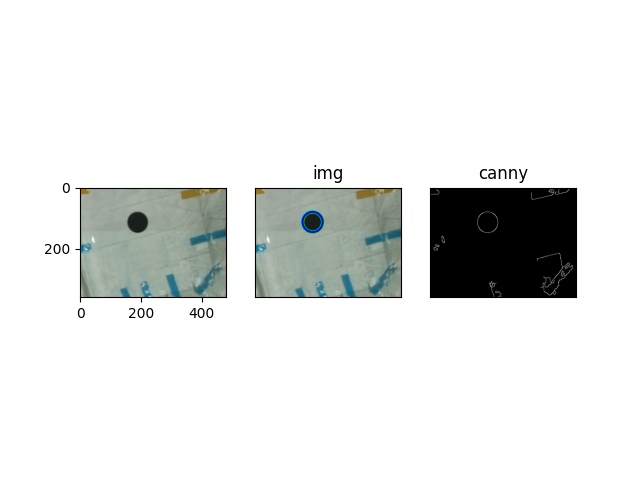
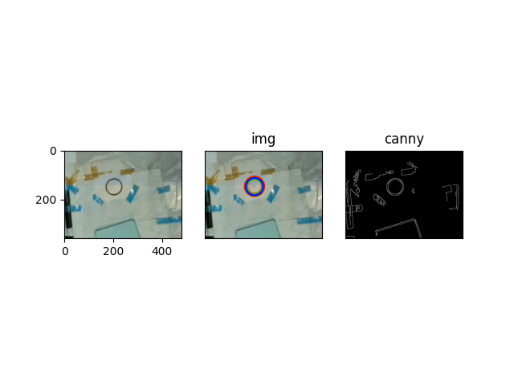
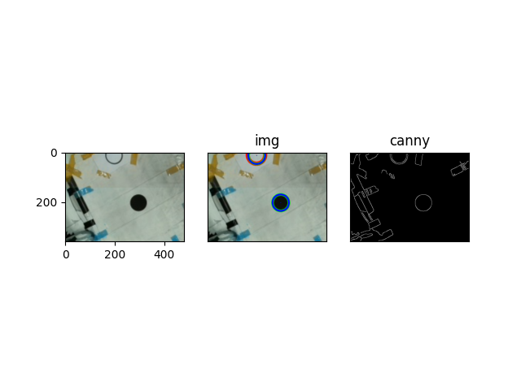

<!--
 * @Description: 
 * @Author: shadow221213
 * @Date: 2023-04-02 16:09:24
 * @LastEditTime: 2023-04-02 16:51:50
-->
# 识别空心圆和实心圆

那天意外发现高斯滤波加Canny进行边缘检测可以十分清晰地识别到空心圆，而中值滤波后可以很轻易地识别到实心圆，于是转念一想，决定将两种结果合并，来实现同时识别空心圆和实心圆的检测。

只是简单检测不重合的圆，将一个想法分享出来而已。

放几张效果图：

